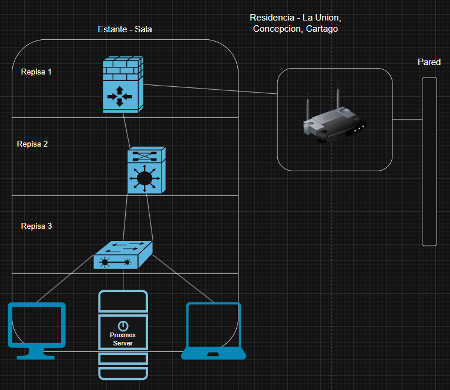
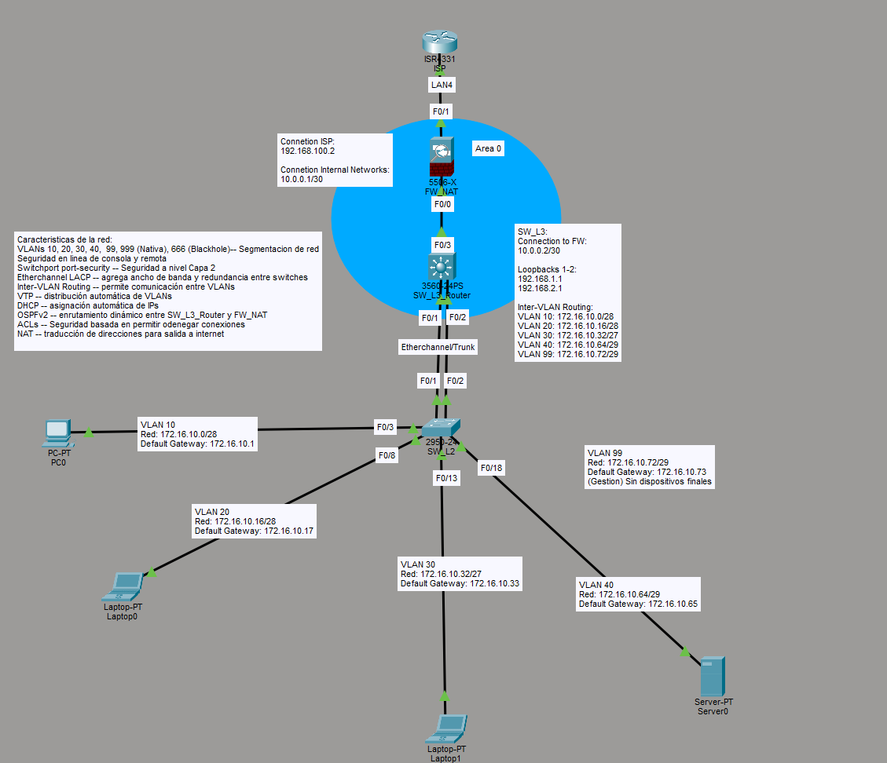
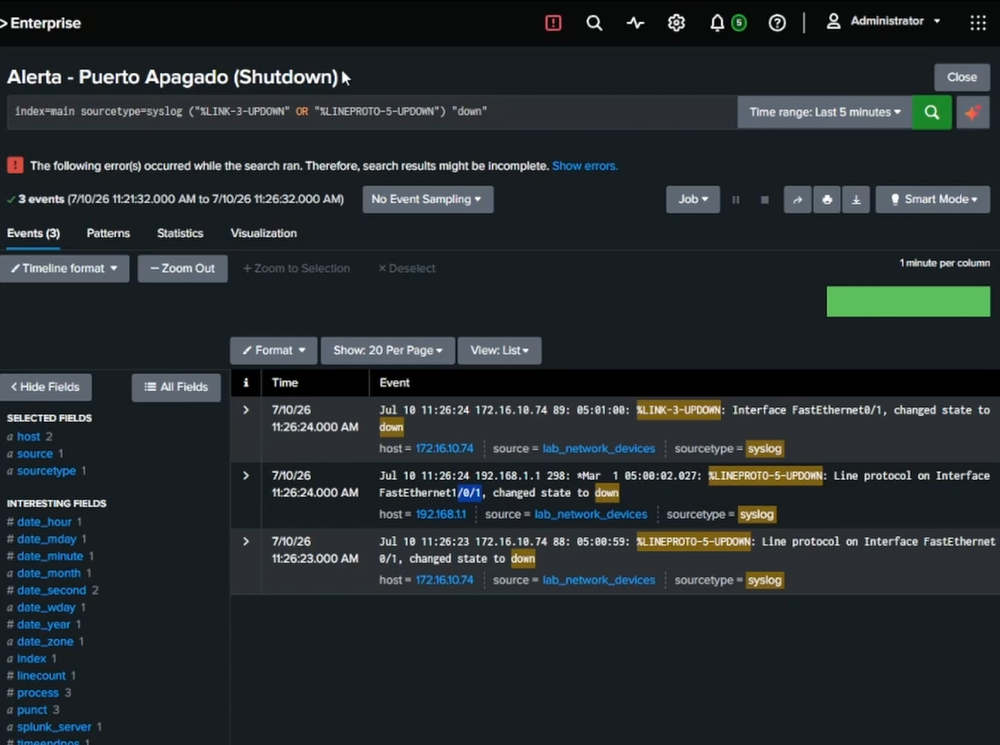
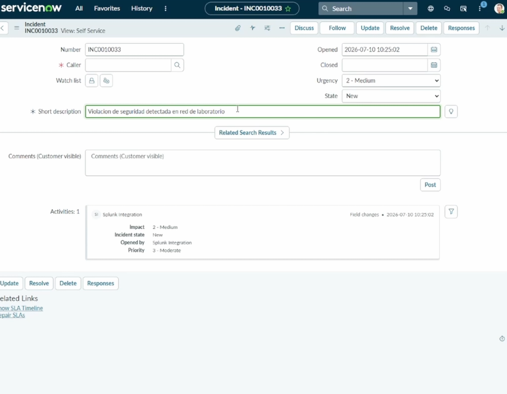
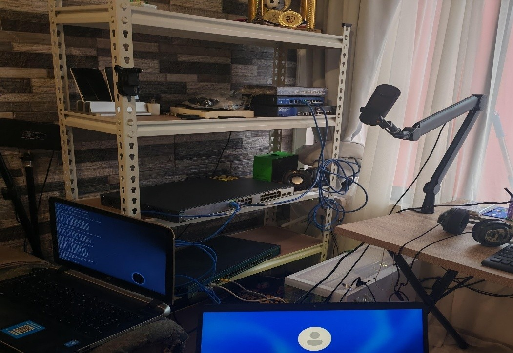

# Enterprise Network Lab

Physical enterprise lab: L2/L3 switching, OSPF, VLAN segmentation, ACL-based security, dual-stack IPv4/IPv6, built on Cisco Catalyst & Juniper SSG.

## Overview

This is a fully physical, multi-vendor enterprise network lab built to design, deploy, and troubleshoot the kind of infrastructure found in a small-to-mid-size corporate environment. Unlike most published labs that run entirely in simulators (Packet Tracer, GNS3, EVE-NG), every device here is real hardware — meaning every issue documented in this repo was a genuine hardware/firmware behavior, not a simulated approximation.

The lab combines:
- **L2/L3 switching** across a Cisco Catalyst 2950 and 3750
- **Perimeter security and NAT** via a Juniper SSG-5 (ScreenOS)
- **Dynamic routing** with OSPF
- **VLAN segmentation** with ACL-enforced inter-VLAN policy
- **Dual-stack IPv4/IPv6** addressing
- **Centralized logging and ITSM integration** via Splunk and ServiceNow (see Bonus Capabilities below)

## Topology




## Technical Architecture

### VLAN Design

| VLAN | Name | Purpose |
|------|------|---------|
| 10 | Administración | Administrative staff |
| 20 | Soporte | Support staff |
| 30 | Invitados | Guest network (isolated) |
| 40 | Servidores | Server segment |
| 99 | Gestión | Out-of-band device management |
| 666 | Cuarentena | Unused/quarantine ports |

Full addressing tables (IPv4/IPv6): see [`docs/Tabla_Direccionamiento_IPv4.png`](docs/Tabla_Direccionamiento_IPv4.png) and [`docs/Tabla_Direccionamiento_IPv6.png`](docs/Tabla_Direccionamiento_IPv6.png).

### Routing

OSPF area 0 runs across the L3 switch and firewall, distributing routes for all VLAN subnets plus the point-to-point link to the SSG-5.

### Security

- Port-security on all access ports (MAC limiting, BPDU guard, portfast)
- Extended ACLs enforcing firewall-management restrictions per VLAN
- IPv6 traffic-filter isolating the guest VLAN from internal segments
- SSH-only management on the L3 switch (Telnet disabled)

## Key Design Decisions

### 1. Double NAT — working around ISP modem limitations

The ISP-provided Huawei OptiXstar modem cannot be fully bridged to pass a public IP directly to the lab's edge device, so it performs its own NAT. To avoid breaking the firewall's own NAT/security policies (and to keep the lab's addressing scheme independent of ISP-assigned addressing), the Juniper SSG-5 performs a second layer of NAT on its Untrust interface. This double-NAT design was a deliberate trade-off: it sacrifices a small amount of routing "cleanliness" in exchange for keeping the internal lab addressing stable and portable, regardless of what the ISP hands out upstream.

### 2. OSPF and the management VLAN — a troubleshooting story

Initial design excluded the Gestión (management) VLAN from OSPF advertisements to the firewall, on the assumption that management traffic didn't need to be routed externally. This broke firewall-based management access from *every* VLAN — because the firewall never learned a return route to the management subnet, it silently dropped the reply traffic.

**Fix:** Gestión was added into OSPF like every other VLAN, and a dedicated `ACL_FIREWALL_MGMT_OUT` was applied to the other VLAN SVIs to restrict which subnets can actually reach the firewall's management plane. This preserved full routability while enforcing the original security intent through ACLs instead of route exclusion — the correct layer for that kind of control.

### 3. Splunk alert scripting — a real integration bug

Automated alerts from Splunk trigger a script that pulls data via `curl` and forwards it to ServiceNow. In testing, the script silently failed. Root cause: Splunk injects its own SSL certificate path into the script's environment at runtime, which overrides the system's default CA bundle and breaks `curl`'s certificate validation against ServiceNow's API.

**Fix:** the script explicitly overrides the certificate path with `--cacert /etc/ssl/certs/ca-certificates.crt`, bypassing Splunk's injected environment variable. Two related gotchas also had to be handled: Splunk's results files are gzip-compressed (requiring `zcat` before parsing) and the script needed explicit execute permissions to run from Splunk's alert action.

## Hardware

- Cisco Catalyst 2950 (L2 access switch)
- Cisco Catalyst 3750 (L3 core switch, IOS `C3750-IPSERVICESK9-M`)
- Juniper SSG-5 (ScreenOS firewall/NAT/routing)
- Huawei OptiXstar (ISP-provided modem)
- Proxmox VE server (hosting Splunk and supporting VMs)

## Bonus Capabilities: Monitoring & ITSM Integration

Beyond core networking, the lab integrates centralized log monitoring and automated ticketing:

- **Splunk Enterprise** ingests syslog from network devices (UDP 514) for centralized visibility
- Custom alert logic triggers on defined conditions and automatically opens tickets in **ServiceNow** via a dedicated integration user (`splunk_integration`, ITIL role)
- This closes the loop between detection and response — an alert in Splunk doesn't just notify, it creates an actionable, tracked incident

**Example: interface down event detected and escalated automatically**


*Splunk alert triggered on a `%LINK-3-UPDOWN` / `%LINEPROTO-5-UPDOWN` syslog event from a lab switch interface.*


*Resulting ServiceNow incident (INC0010033), auto-created by the Splunk integration with severity and description inherited from the alert.*

## Repository Structure

```
enterprise-network-lab/
├── README.md
├── configs/      → Sanitized running-configs (switches, firewall)
├── docs/         → VLAN table, IPv4/IPv6 addressing tables, monitoring screenshots
├── photos/       → Physical lab photos
└── topology/     → Physical and logical topology diagrams
```

## Lab Photos

